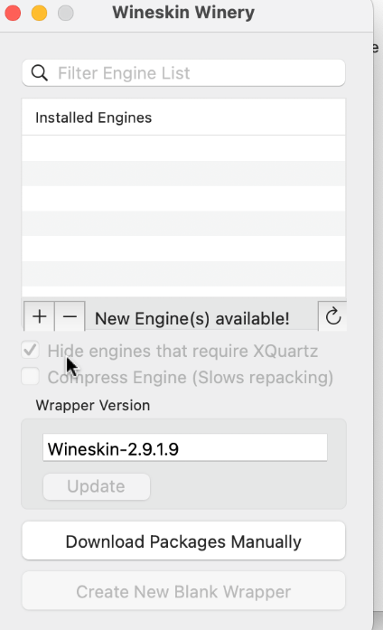
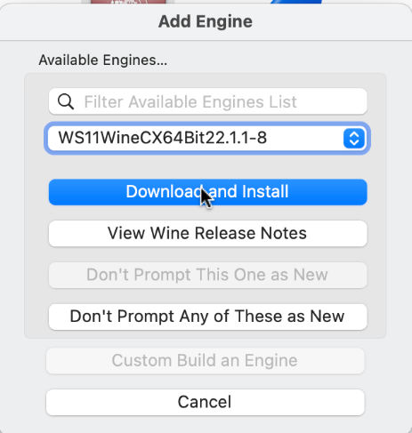
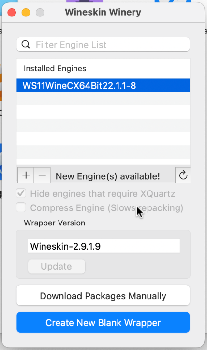
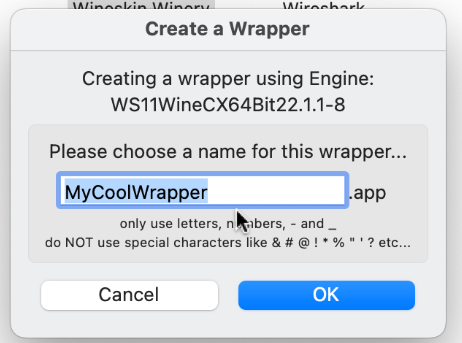
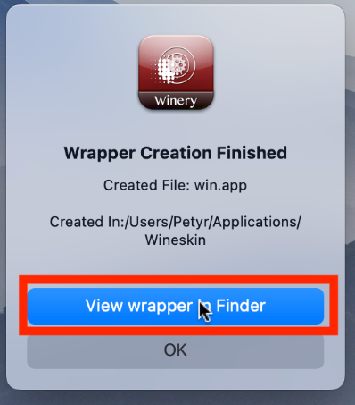
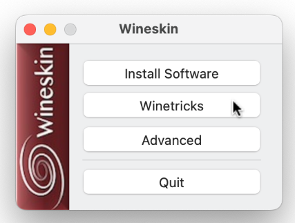
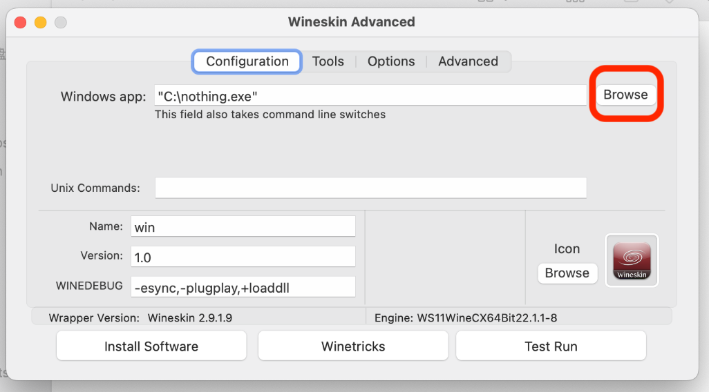

MacOS-wineskin
--------------

### Introduction

Wineskin是一个用于macOS的工具，它允许用户将Windows应用程序封装到一个macOS应用程序包中。它基于Wine，一个开源的工具，能够在Linux、macOS和其他Unix-like操作系统上运行Windows软件。简而言之，Wineskin为macOS用户提供了一个用户友好的界面来使用Wine，并使得把Windows程序变为Mac应用变得简单。

以下是Wineskin的主要特点和工作原理：

1.
创建独立的Mac应用程序：使用Wineskin，你可以将Windows应用程序和所有必要的支持文件、库及Wine组件打包成一个单独的Mac应用程序。这意味着你可以像启动任何其他Mac应用程序一样启动这个封装的应用程序，而不需要任何额外的配置或启动步骤。

2.
简单的图形用户界面：与使用命令行界面的Wine相比，Wineskin为用户提供了一个简单易用的图形界面，使得封装和管理Windows应用程序变得直观。

3.
自定义封装：Wineskin允许用户为每个应用程序选择特定的Wine版本、安装额外的库或组件，并进行其他高级配置。这为不同的应用程序提供了很大的灵活性。

4.
独立的Wine环境：每个用Wineskin创建的Mac应用程序都有其自己独立的Wine环境（称为Wineskin
Wrapper）。这意味着每个应用程序都可以有其自己的设置和配置，而不会影响其他应用程序。

需要注意的是，尽管Wineskin提供了一个方便的方法来运行Windows应用程序，但它仍然依赖于Wine的兼容性。这意味着，并不是所有的Windows应用程序都能在Wineskin或Wine下完美运行。可能会遇到某些兼容性问题或功能缺失。

对于使用 Apple Silicon（如 M1 或 M2 芯片的 Mac）的用户，使用 Wineskin
前，务必检查其是否完全支持这些新的硬件平台，并了解为确保兼容性而需要进行的特定设置。

### Install

#### MacOS

1.下载：请访问 \[Wineskin
Server\](https://github.com/Gcenx/WineskinServer/releases/) 下载
Wineskin。

2.安装：双击下载的文件进行解压，之后你将看到一个名为 \`Wineskin
Winery.app\` 的应用程序。将此应用程序拖放到“应用程序”文件夹中。

### Usage

#### 创建app

1\. 打开 \`Wineskin
Winery.app\`（右键点击应用图标并选择打开，系统可能会弹出安全警告，点击“确定”继续）。

2\. 在界面中点击 \`+\` 按钮，接着选择“创建引擎” -&gt;
“选择引擎”，然后点击 "download and install" 进行下载和安装。

3\. 完成后返回主界面，点击“Create New Blank Wrapper”创建一个新的
Wrapper，为其命名并点击“确定”。

软件会感觉像死机了一样，但过一会就会恢复，如果实在等太久，可以强制关闭再打开重新Create，因为wine是针对x86架构的芯片开发的，再Apple芯片上运行需要转译，会花很长时间

4\. 创建完成后，你会看到一个提示窗口，点击“View wrapper in
Finder”查看你创建的 Wrapper。

5\. 双击app启动点击Advanced进入高级配置

6\. 在Configuration-&gt;栏的browse--&gt;选择默认目录的的drive\_c -&gt;
windows -&gt; explorer.exe--&gt;然后点击Test Run

就会弹出一个窗口，这个窗口就是wine模拟的windows资源管理器,然后就可以把wineskin
Advanced窗口和windows资源管理器关了

7.在启动台你就会发现一个多出来的应用,打开过后就是一个windows资源管理器，你可以在这个里面打开windows程序

现在，你可以打开你创建的
Wrapper，点击“Advanced”进入高级设置，选择“Install software”安装你需要的
Windows 应用程序。

#### 安装字体

1. 下载字体文件：windows-10-font.zip
   
   https://github.com/litongjava/wine-macos-m2-apps/releases/download/0.0.0/windows-10-font.zip

2\. 将下载的字体文件添加到应用内部的 \`drive\_c -&gt; windows -&gt;
Font\` 目录。

#### 安装软件

在 Wineskin 的高级配置界面，选择“Install software”进行软件安装。

### 笔者封装的一些app

下载地址

https://github.com/litongjava/wine-macos-m2-apps/releases/
